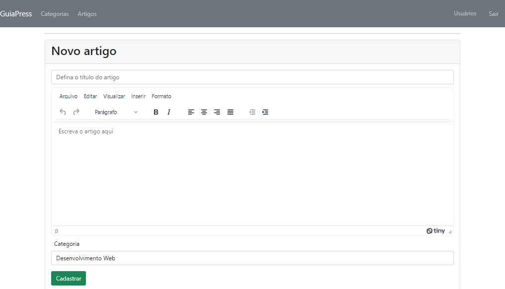
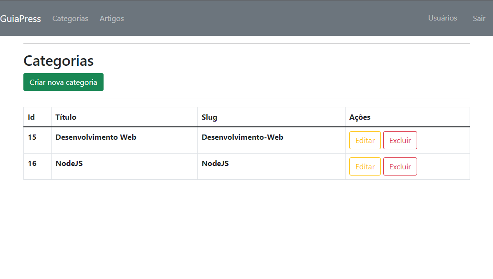
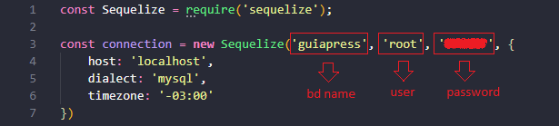

# Projeto Blog com painel administrativo(CRUD completo).

---

## 🔖Sobre

Aplicação baseada em criação de categorias e artigos em banco de dados relacional. Sendo possível cadastro de usuários e validação de login.

---
#### Cadastro de artigos

---

## 💻Teconologias Utilizadas

- HTML
- CSS
- Bootstrap
- JavaScript
- NodeJS
- Express
- MySQL
- Sequelize
- EJS

---
#### Cadastro de categorias

## 💽 Instalação

Necessário instalação das dependências ( $ npm install ) + criação da base de dados em MySQL.

Para configurar a conexão, abra o arquivo database.js e altere os dados:

## Rota para criação de usuário

- /admin/users/create

---

## 🔎 Observações
Projeto feito no curso Formação NodeJS.

---

Desenvolvido por Márkys Corrêa.
